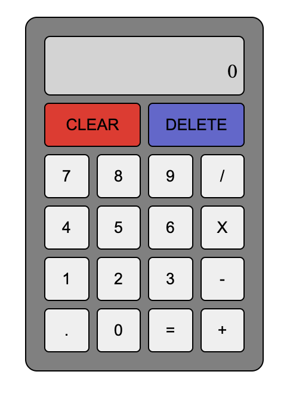

# The Odin Project - Calculator

This is a solution to the [the calculator app](https://www.theodinproject.com/paths/foundations/courses/foundations/lessons/calculator) on [The Odin Project](https://www.theodinproject.com/).

### The challenge

The calculator should be able to:

- Add, subtract, multiply, and divide
- Store and evaluate a sequence of calculations
- Display final and intermediate results
- Clear its results

### Screenshot

### Links

- [Solution](https://github.com/LandonRGeorge/odin-calculator)
- [Live Site](https://landonrgeorge.github.io/odin-calculator/)

## Built with

- HTML
- CSS (including Flexbox and Grid)
- JavaScript
